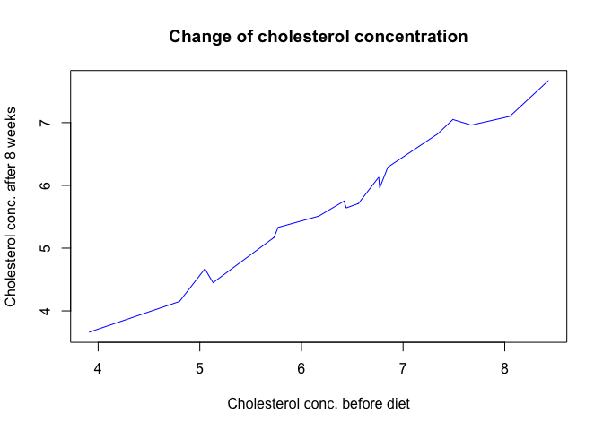
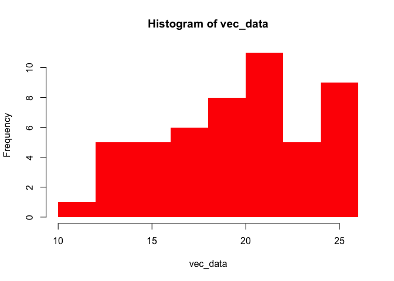
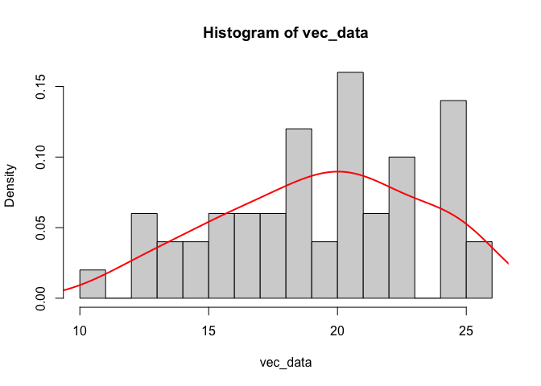
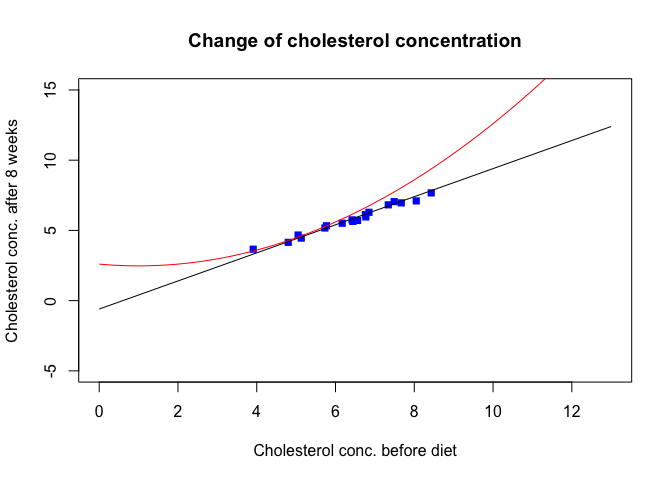

-   [Class 10](#class-10)
    -   [Data](#data)
    -   [Formula notation](#formula-notation)
    -   [Simple R plot](#simple-r-plot)
    -   [Using colours in R plots](#using-colours-in-r-plots)
    -   [Assigning colours to
        variables](#assigning-colours-to-variables)
    -   [Histogram](#histogram)
    -   [Setting non-graphical
        parameters](#setting-non-graphical-parameters)
    -   [Using `ggplot2` - introduction](#using-ggplot2---introduction)
    -   [`ggplot2` scatterplot](#ggplot2-scatterplot)
    -   [Annotating the plot, other dimensions of
        data](#annotating-the-plot-other-dimensions-of-data)
    -   [`ggplot2` histogram](#ggplot2-histogram)
    -   [ADDITIONAL EXERCISES](#additional-exercises)

Class 10
========

**In the below instructions…**

**EXERCISE 1:** are bits of code to execute/practice pieces to do, often
with only hints on how to perform them.

**Output** indicates the typical output you should expect from a given
instruction.

Data
----

We will work on a simple dataset on cholesterol levels from patients.
The data presents cholesterol concentrations in plasma in patients
before diet, and after 4 & 8 weeks of diet containing one of two types
of margarine. The age group of patients is also indicated. Data can be
downloaded here:
<a href="https://raw.githubusercontent.com/wbabik/Practical_computing/teaching/Class_10/data/Cholesterol_Age_R.csv" class="uri">https://raw.githubusercontent.com/wbabik/Practical_computing/teaching/Class_10/data/Cholesterol_Age_R.csv</a>

``` r
data_chol <- read.table('https://raw.githubusercontent.com/wbabik/Practical_computing/teaching/Class_10/data/Cholesterol_Age_R.csv',
                       sep = ';', header = T,
                       stringsAsFactors = T)

head(data_chol)
```

    ##   ID Before After4weeks After8weeks Margarine AgeGroup
    ## 1  1   6.42        5.83        5.75         B    Young
    ## 2  2   6.76        6.20        6.13         A    Young
    ## 3  3   6.56        5.83        5.71         B    Young
    ## 4  4   4.80        4.27        4.15         A    Young
    ## 5  5   8.43        7.71        7.67         B    Young
    ## 6  6   7.49        7.12        7.05         A   Middle

``` r
summary(data_chol)
```

    ##        ID            Before       After4weeks     After8weeks    Margarine
    ##  Min.   : 1.00   Min.   :3.910   Min.   :3.700   Min.   :3.660   A:9      
    ##  1st Qu.: 5.25   1st Qu.:5.740   1st Qu.:5.175   1st Qu.:5.210   B:9      
    ##  Median : 9.50   Median :6.500   Median :5.830   Median :5.730            
    ##  Mean   : 9.50   Mean   :6.408   Mean   :5.842   Mean   :5.779            
    ##  3rd Qu.:13.75   3rd Qu.:7.218   3rd Qu.:6.730   3rd Qu.:6.688            
    ##  Max.   :18.00   Max.   :8.430   Max.   :7.710   Max.   :7.670            
    ##    AgeGroup
    ##  Middle:6  
    ##  Old   :7  
    ##  Young :5  
    ##            
    ##            
    ## 

Formula notation
----------------

R modelling and graphing functions use a particular type of notation,
originating from the S-PLUS language, to represent relationships between
variables. Proportionality in this notation is indicated by `~`,
left-hand-side (LHS) of the formula contains dependent variables,
right-hand-side (RHS) independent. E.g., `y ~ x + z` may be used to
write down a relationship between a measured `y` variable and two
independent variables (`x` and `z`). Simple formulas (one LHS and one
RHS variable) are covenietnly used to assign variables to axes of a
plot.

Simple R plot
-------------

First…

> *It is a myth that R is incapable of producing a final, publication
> quality (and pretty!) plot that would not have to be modified
> afterwards :)*

To represent data graphically we have to asign it to the proper plot
axis. The simplest way of plotting data in R is by using a built-in
function `plot()`. Variables to plot can be supplied as its arguments,
respectively as **x** (horizontal axis) i **y** (vertical axis) - or by
supplying one argument, a formula, describing the relationship between
the dependent and independent variable, or in other words between x & y
as `y ~ x`. Have a look into `?plot()` to learn more. Note, that -
depending on the situation - you may have to provide just variable names
together with the name of the dataset - using `data = ...` - or to
directly call variables in your dataset (e.g. by using
`...$variable_x`).

**EXERCISE 1:**Try to recreate the below plot using the loaded data.
Consult the `plot()` function if necessary.

**Output**


**EXERCISE 2:** Modify the plot changing the shapes and colours used on
the plot (hints can be found here:
<a href="https://www.r-graph-gallery.com/6-graph-parameters-reminder.html" class="uri">https://www.r-graph-gallery.com/6-graph-parameters-reminder.html</a>).
Here I’m setting the symbols as blue squares.

**Output**


**EXERCISE 3:** The `plot()` function has the `type` argument - try to
see what this argument does. What happens if we set it to `'n'`?

**Output**


Using the `type = 'l'` leads to a surprising problem - instead of an
expected zig-zag line connecting the points we gat a weird squiggly
bunch of loops. What should be done to the data to retrieve a proper
line plot, like the one below?

**Output**



Using colours in R plots
------------------------

**EXERCISE 4:** Colours and shapes on a plot can be changed at will. Try
to experiment in order to recreate the below plot. Note: you have to
creat your own data or input it directly into the plotting function.
Information about colour codes can be found here:
<a href="http://derekogle.com/NCGraphing/resources/colors" class="uri">http://derekogle.com/NCGraphing/resources/colors</a>
- in summary, you can choose them by indicating their names (e.g.
`"hotpink"`) or specifying a colour’s name in a hexadecimal number
system (e.g. `"#AA6574"`).

**Output**


Assigning colours to variables
------------------------------

Apart from naming the colours directly - we can assign them to
particular values in our data. If data has values directly compatible
with R colours (i.e., integers from 1 to 9), they can be used directly
as colour identifiers.

**EXERCISE 5:** The below plot uses colours to cod the age groups in our
data - try to recreate this plot by linking the `col` option to the
relevant data variable. What key is ues to choose specific colours on
the plot?

**Output**


**EXERCISE 6:** If you would like to use non-default colours here, you
have to use the fact that levels o a categorical variable in R (e.g.,
`AgeGroup`) are coded as integers, and hence can be treated as indices
selecting values from a vector of colour names/codes:

**Output**

``` r
plot(After8weeks ~ Before, data = data_chol,
xlab = "Cholesterol conc. before diet",
ylab = "Cholesterol conc. after 8 weeks",
main = "Change of cholesterol concentration",
pch = 15, col = c('pink', 'chartreuse', 'brown')[data_chol$AgeGroup])
```


------------------------------------------------------------------------

Histogram
---------

Histogram is a useful and frequently used type of plot - it can be
generated using the `hist()` function.

**EXERCISE 7:** Create a histogram of 50 ranom samples from a normal
distribution with mean 20 and standard deviation 4 (you may want to use
the following call `rnorm(50, 20, 4)`). **Output**


Histogram does not have one colour parameter - each rectangle has a
border and its filling. Consulting `?hist()` check how to reproduce the
below version of a histogram.

**Output**



**EXERCISE 8:** Redo the histogram by increasing the number of binning
intervals. **Output** (example)


**EXERCISE 9:** instead of a histogram, distributional data can be
presented using a smoothed density of data (*kernel density*). You can
use the built-in function `density()` to produce such curve, and it can
be overlaid on an existing plot using the `lines()` function (similarly,
to the `points()` function overlaying points, the `lines()` function
does not create a new plot but adds lines to an existing plot ). Try to
recreate the above histogram adding to it an overlaid density line:
**Output** (example)



Setting non-graphical parameters
--------------------------------

R plots generated by the basic function can be modified in many ways, to
adjust their appearance to particular needs. A number of parameters can
be set inside the `plot()` function, but others can be set using a
special `par()` function.

**EXERCISE 10:** The plotting area can be modified by setting the limits
of the axes - to achieve this modify the `ylim` and `xlim` arguments,
they take vectors of length 2 as values. **Output**


Such option becomes especially useful when plotting custom curves, that
need to be displayed in some speciic range. Compare the two below plots:

``` r
plot(After8weeks ~ Before, data = data_chol,
xlab = "Cholesterol conc. before diet",
ylab = "Cholesterol conc. after 8 weeks",
main = "Change of cholesterol concentration",
pch = 15, col = "blue")

curve(-0.6 + x, add = T)
curve(2.6 - 0.25*x + 0.125*x^2, add = T, col = 'red')
```


``` r
plot(After8weeks ~ Before, data = data_chol,
xlab = "Cholesterol conc. before diet",
ylab = "Cholesterol conc. after 8 weeks",
main = "Change of cholesterol concentration",
pch = 15, col = "blue",
xlim = c(0, 13), ylim = c(-5, 15))

curve(-0.6 + x, add = T)
curve(2.6 - 0.25*x + 0.125*x^2, add = T, col = 'red')
```



**EXERCISE 11:** Try applying similar modification to our final
histogram, to avoid automativ selection of x-axis ends (which slightly
misses the limits o actual data).

**Output** (example)


**EXERCISE 12:** The plotting function options can also be used to
change the type of axes to logged - we can achieve this in two ways,
resulting in two different ways of presentation. The simplest is to use
the `log` option in the `plot()` function: **Output**

``` r
plot(After8weeks ~ Before, data = data_chol,
xlab = "Cholesterol conc. before diet",
ylab = "Cholesterol conc. after 8 weeks",
main = "Change of cholesterol concentration",
pch = 15, col = "blue", log = "x")
```


However, you can also directly log the data while plotting it (how would
you achieve this?). **Output**


The plots look similar - but there is one fundamental difference - what
is it? What type of log was used in these plots?

**EXERCISE 13:** In order to modify plot parameters such as its margins
- we have to use the `par()` function, and we should modify specific
parameters in it. Be aware, that the setting chosen will affect any
future plot produced in a given session of R. Try using the `mai` option
(which specifies distances in inches) or `mar` option (which specify
distances in lines of text) to change the plot margins (each of these
options takes a vector with 4 elements, the margins of bottom, left, top
and right edge). The below picture demonstrates how the margin
parameters are interpreted with respect to a plotting area:


**Output**


If at any stage you use the `par()` function and loose track of what
parameters have been modified and which haven’t (or - another function
happens to modify some graphical parameters beyond your control) you can
easily reset the plotting standard output to the default graphical
parameters. Just run:

``` r
dev.off()
```

which will close and reset the active (screen) plotting output.

Using `ggplot2` - introduction
------------------------------

Control over the graphical parameters in the `plot()` function is
rudimentary. The **ggplot2** package gives much more control over how
the plots are made and built. The **ggplot2** package is based on so
called graphics grammar, a set of rules describing the visual appearance
of a plot:

-   linking of data to specific elements of a plot (so called
    **mapping**) is separated from its actual appearance (i.e.,
    **aesthetics**);
-   the plot has a layered structure, with latter elements appearing on
    top of the former ones;
-   if possible all plot elements should be built on the go, inside of
    the plotting code, without the need of modifying/transforming the
    original data.

A simple *ggplot2* graph may be structured as follows:

``` r
mygraph <- ggplot2(data = MYDATA,
                  mapping = aes(x = VAR1, y = VAR2, ...)) +
  geom_1(OPTIONS) +
  geom_2(OPTIONS)

plot(mygraph)

graph2 <- mygraph + geom_3
plot(graph2)
```

Calling the `ggplot()` function may be used only to create an object of
class `ggplot`, without displaying the actual graph. Such object will
contain the data and its mappings to specific elements of the final
plot. To display it, we need additional function from the `geom_...`
family, which add specific visual elements to the defined mappings (e.g.
`geom_point` adds scatterpoints, `geom_hist` forms a histogram).
Subsequent elements can be concatenated using the `+` operator. other
elements that can be added to the plot using `+` are display and
aesthetic rules, e.g. `theme()`, which describe the appearance of
non-data elements of a plot.

Load the `ggplot2` - if you don;t have it use `install.packages()` to
install it.

``` r
# install.packages('ggplot2')
library(ggplot2)
```

`ggplot2` scatterplot
---------------------

**EXERCISE 14:** Make a scatterplot similar to one of the previous
excersises, mapping the concentrations of cholesterol on the x and y
axes. Use blue squares as points. You may want to use the `cex` option
to increase the default symbol size (`cex` defines a multiplicative
coefficient, that increases or decreases plot elements given number of
times).

**Output**


**EXERCISE 15:** Let’s improve the plot by removing the annoying gray
background. add the `theme_...()` call to the plot (you can review
different predefined versions of it here
<a href="https://ggplot2.tidyverse.org/reference/ggtheme.html" class="uri">https://ggplot2.tidyverse.org/reference/ggtheme.html</a>)
to produce a cleaner graph. **Output**


**EXERCISE 16:** An even more aesthetically-pleasing plot can be
produced using the “classic” theme. Try also, by addind the `theme()`
definition to the plot, to modify the `text` element using the following
formatting: `element_text(size = 20)` - which should increase the
default font sizing). **Output**


**EXERCISE 17:** Add the `geom_smooth` aesthetic to the plot, selecting
the `lm` method as its option. Do you know what does `lm` indicate?
**Output**

    ## `geom_smooth()` using formula 'y ~ x'


**EXERCISE 18:** Modify the above call to change the appearance of the
regression line. **Output**

    ## `geom_smooth()` using method = 'loess' and formula 'y ~ x'


Annotating the plot, other dimensions of data
---------------------------------------------

**EXERCISE 19:** Try to map the age groups (`AgeGroup`) to the graph
points’ colours. Using the `alpha` option (taking values 0 - 1 - which
indicates the transparency of the regression error band) I decreased the
cluttered appearance of the plot, making the error bands a bit more
subtle. **Output**

    ## `geom_smooth()` using formula 'y ~ x'


**EXERCISE 20:** let’s add the `labs()` layer with a bit more readable
axes names. **Output**

    ## `geom_smooth()` using formula 'y ~ x'


**EXERCISE 21:** An alternative way of coding age gropups - instead of
mapping it to colours - may be splitting the groups by so called
*facets*, which presents subsets of data on separate subplots using a
common scale. To achieve this you should use the `facet_wrap()`
function, which takes a formula of the form `~ A`, where A indicates a
variable from the dataset that defines the split of the graph area into
subplots. (An analogous function `facet_grid()` handles well two-sided
formulas `A ~ B` that define a grid of plots). Try to recreate the below
plot - it may look better with the `theme_bw()` style, instead of the
"classic’ one. **Output**

    ## `geom_smooth()` using formula 'y ~ x'


`ggplot2` histogram
-------------------

**EXERCISE 22:** Using the `geom_hist()` geometry create a histogram of
the `After8weeks` variable. **Output**


**EXERCISE 23:** Change the histogram so that it displays relative
frequencies of data in each bin, and not absolute counts. Inspiration on
how to do this can be found here:
<a href="https://homepage.divms.uiowa.edu/~luke/classes/STAT4580/histdens.html" class="uri">https://homepage.divms.uiowa.edu/~luke/classes/STAT4580/histdens.html</a>
- there are at least two ways of achieving this goal!

**Output**


**EXERCISE 24:** Modify the histogram to add a kernel density estimator
to it (it is an analogue of the `density()` function we have used
earlier).

**Output**


------------------------------------------------------------------------

------------------------------------------------------------------------

ADDITIONAL EXERCISES
--------------------

1.  `geom_boxplot()` can be used to visualise categorical data. In base
    R this is achieved by using the `boxplot()` function:

``` r
boxplot(Before ~ AgeGroup, data = data_chol,
        xlab = "Age group", ylab = "Cholesterol conc. before the experiment")
```


Try to produce such plot, showing the cholesterol concentrations before
the diet, categorised by age groups, in `ggplot2`. Use `?geom_boxplot`
and if needed the book
<a href="https://ggplot2-book.org" class="uri">https://ggplot2-book.org</a>
to find out how to achieve this. On such boxplot - what is the meaning
of: the boundaries of each box, the ends of the whiskers and the
additional points added to the plot?


1.  A boxplot may be much more informative if we add raw data to it. It
    can be done in many ways - e.g., to achieve an effect similar to
    this one;
    <a href="https://bit.ly/31estrN" class="uri">https://bit.ly/31estrN</a>.
    Try to produce a similar plot using additional data (file
    `Diet_R.csv`, which presents weight loss of patients on three
    different diets). Before using the data clean it from all missing
    values (`na.omit()`). Data can be found here:
    <a href="https://raw.githubusercontent.com/wbabik/Practical_computing/teaching/Class_10/data/Diet_R.csv" class="uri">https://raw.githubusercontent.com/wbabik/Practical_computing/teaching/Class_10/data/Diet_R.csv</a>


