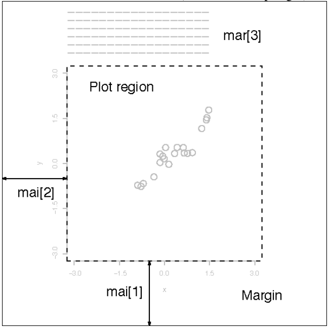

```{css, echo=FALSE}
.bluef {
  color: blue;
}

.magf {
  color: magenta;
}
```

```{r setup, include=FALSE}
knitr::opts_chunk$set(echo = FALSE)
```


**In the below instructions...**

<span class = magf>**EXERCISE 1: **</span> are bits of code to execute/practice pieces to do, often with only hints on how to perform them.

<span class = bluef>**Output**</span> indicates the typical output you should expect from a given instruction.

## Data

We will work on a simple dataset on cholesterol levels from patients. The data presents cholesterol concentrations in plasma in patients before diet, and after 4 & 8 weeks of diet containing one of two types of margarine. The age group of patients is also indicated.

```{r echo = T}
data_chol <- read.table('Cholesterol_Age_R.csv',
                       sep = ';', header = T,
                       stringsAsFactors = T)

head(data_chol)
summary(data_chol)
```

## Formula notation

R modelling and graphing functions use a particular type of notation, originating from the S-PLUS language, to represent relationships between variables. Proportionality in this notation is indicated by `~`, left-hand-side (LHS) of the formula contains dependent variables, right-hand-side (RHS) independent. E.g., `y ~ x + z` may be used to write down a relationship between a measured `y` variable and two independent variables (`x` and `z`). Simple formulas (one LHS and one RHS variable) are covenietnly used to assign variables to axes of a plot.

## Simple R plot

First...

> *It is a myth that R is incapable of producing a final, publication quality (and pretty!) plot that would not have to be modified afterwards :)*


To represent data graphically we have to asign it to the proper plot axis. The simplest way of plotting data in R is by using a built-in function `plot()`. Variables to plot can be supplied as its arguments, respectively as **x** (horizontal axis) i **y** (vertical axis) - or by supplying one argument, a formula, describing the relationship between the dependent and independent variable, or in other words between x & y as `y ~ x`. Have a look into `?plot()` to learn more. Note, that - depending on the situation - you may have to provide just variable names together with the name of the dataset - using `data = ...` - or to directly call variables in your dataset (e.g. by using `...$variable_x`).

<span class = magf>**EXERCISE 1: **</span>Try to recreate the below plot using the loaded data. Consult the `plot()` function if necessary.

<span class = bluef>**Output**</span>
```{r}
plot(After8weeks ~ Before, data = data_chol,
xlab = "Cholesterol conc. before diet",
ylab = "Cholesterol conc. after 8 weeks",
main = "Change of cholesterol concentration")

### OR

# plot(x = data_chol$Before, y = data_chol$After8weeks,
# xlab = "Cholesterol conc. before diet",
# ylab = "Cholesterol conc. after 8 weeks",
# main = "Change of cholesterol concentration")
```

<span class = magf>**EXERCISE 2: **</span> Modify the plot changing the shapes and colours used on the plot (hints can be found here: <https://www.r-graph-gallery.com/6-graph-parameters-reminder.html>). Here I'm setting the symbols as blue squares.

<span class = bluef>**Output**</span>
```{r}
plot(After8weeks ~ Before, data = data_chol,
xlab = "Cholesterol conc. before diet",
ylab = "Cholesterol conc. after 8 weeks",
main = "Change of cholesterol concentration",
pch = 15, col = "blue")
```


<span class = magf>**EXERCISE 3: **</span> The `plot()` function has the `type` argument - try to see what this argument does. What happens if we set it to `'n'`?

<span class = bluef>**Output**</span>
```{r}
plot(After8weeks ~ Before, data = data_chol,
xlab = "Cholesterol conc. before diet",
ylab = "Cholesterol conc. after 8 weeks",
main = "Change of cholesterol concentration",
pch = 15, col = "blue")

plot(After8weeks ~ Before, data = data_chol,
xlab = "Cholesterol conc. before diet",
ylab = "Cholesterol conc. after 8 weeks",
main = "Change of cholesterol concentration",
pch = 15, col = "blue", type = 'l')

plot(After8weeks ~ Before, data = data_chol,
xlab = "Cholesterol conc. before diet",
ylab = "Cholesterol conc. after 8 weeks",
main = "Change of cholesterol concentration",
pch = 15, col = "blue", type = 'h')
```


Using the `type = 'l'` leads to a surprising problem - instead of an expected zig-zag line connecting the points we gat a weird squiggly bunch of loops. What should be done to the data to retrieve a proper line plot, like the one below?

<span class = bluef>**Output**</span>
```{r}
plot(After8weeks ~ Before, data = data_chol[order(data_chol$Before),],
xlab = "Cholesterol conc. before diet",
ylab = "Cholesterol conc. after 8 weeks",
main = "Change of cholesterol concentration",
pch = 15, col = "blue", type = 'l')
```


## Using colours in R plots

<span class = magf>**EXERCISE 4: **</span> Colours and shapes on a plot can be changed at will. Try to experiment in order to recreate the below plot. Note: you have to creat your own data or input it directly into the plotting function. Information about colour codes can be found here: <http://derekogle.com/NCGraphing/resources/colors> - in summary, you can choose them by indicating their names (e.g. `"hotpink"`) or specifying a colour's name in a hexadecimal number system (e.g. `"#AA6574"`).

<span class = bluef>**Output**</span>
```{r}
N <- 11
plot(1:N, rep(1, N), cex = 10, pch = 19,
     col = c('firebrick3', 'orangered', 'orange', 'goldenrod',
             'greenyellow', 'chartreuse', 'springgreen', 'darkturquoise',
             'cornflowerblue', 'mediumblue', 'blueviolet'),
     xlab = 'x', ylab = 'y')

### OR for automated colour generation

plot(1:N, rep(1, N), cex = 10, pch = 19,
     col = rainbow(N),
     xlab = 'x', ylab = 'y')
```


## Assigning colours to variables

Apart from naming the colours directly - we can assign them to particular values in our data. If data has values directly compatible with R colours (i.e., integers from 1 to 9), they can be used directly as colour identifiers. 

<span class = magf>**EXERCISE 5: **</span> The below plot uses colours to cod the age groups in our data - try to recreate this plot by linking the `col` option to the relevant data variable. What key is ues to choose specific colours on the plot?

<span class = bluef>**Output**</span>
```{r}
plot(After8weeks ~ Before, data = data_chol,
xlab = "Cholesterol conc. before diet",
ylab = "Cholesterol conc. after 8 weeks",
main = "Change of cholesterol concentration",
pch = 15, col = data_chol$AgeGroup)
```


<span class = magf>**EXERCISE 6: **</span> If you would like to use non-default colours here, you have to use the fact that levels o a categorical variable in R (e.g., `AgeGroup`) are coded as integers, and hence can be treated as indices selecting values from a vector of colour names/codes:

<span class = bluef>**Output**</span>
```{r echo = T}
plot(After8weeks ~ Before, data = data_chol,
xlab = "Cholesterol conc. before diet",
ylab = "Cholesterol conc. after 8 weeks",
main = "Change of cholesterol concentration",
pch = 15, col = c('pink', 'chartreuse', 'brown')[data_chol$AgeGroup])
```


***

## Histogram

Histogram is a useful and frequently used type of plot - it can be generated using the `hist()` function.

<span class = magf>**EXERCISE 7: **</span> Create a histogram of 50 ranom samples from a normal distribution with mean 20 and standard deviation 4 (you may want to use the following call `rnorm(50, 20, 4)`).
<span class = bluef>**Output**</span>
```{r}
set.seed(123456789)
vec_data <- rnorm(50, 20, 4)
hist(vec_data)
```

Histogram does not have one colour parameter - each rectangle has a border and its filling. Consulting `?hist()` check how to reproduce the below version of a histogram.

<span class = bluef>**Output**</span>
```{r}
set.seed(123456789)
vec_data <- rnorm(50, 20, 4)
hist(vec_data, col = 'red', border = NA)
```

<span class = magf>**EXERCISE 8: **</span> Redo the histogram by increasing the number of binning intervals.
<span class = bluef>**Output**</span> (example)
```{r}
set.seed(123456789)
vec_data <- rnorm(50, 20, 4)
hist(vec_data, 20)
```

<span class = magf>**EXERCISE 9: **</span> instead of a histogram, distributional data can be presented using a smoothed density of data (*kernel density*). You can use the built-in function `density()` to produce such curve, and it can be overlaid on an existing plot using the `lines()` function (similarly, to the `points()` function overlaying points, the `lines()` function does not create a new plot but adds lines to an existing plot ). Try to recreate the above histogram adding to it an overlaid density line:
<span class = bluef>**Output**</span> (example)
```{r}
set.seed(123456789)
vec_data <- rnorm(50, 20, 4)
hist(vec_data, 20, freq = F)
lines(density(vec_data), col = 'red', lwd = 2)
```


## Setting non-graphical parameters

R plots generated by the basic function can be modified in many ways, to adjust their appearance to particular needs. A number of parameters can be set inside the `plot()` function, but others can be set using a special `par()` function.

<span class = magf>**EXERCISE 10: **</span> The plotting area can be modified by setting the limits of the axes - to achieve this modify the `ylim` and `xlim` arguments, they take vectors of length 2 as values.
<span class = bluef>**Output**</span>
```{r}
plot(After8weeks ~ Before, data = data_chol,
xlab = "Cholesterol conc. before diet",
ylab = "Cholesterol conc. after 8 weeks",
main = "Change of cholesterol concentration",
pch = 15, col = "blue",
xlim = c(0, 10), ylim = c(-5, 15))
```

Such option becomes especially useful when plotting custom curves, that need to be displayed in some speciic range. Compare the two below plots:

```{r echo = T}
plot(After8weeks ~ Before, data = data_chol,
xlab = "Cholesterol conc. before diet",
ylab = "Cholesterol conc. after 8 weeks",
main = "Change of cholesterol concentration",
pch = 15, col = "blue")

curve(-0.6 + x, add = T)
curve(2.6 - 0.25*x + 0.125*x^2, add = T, col = 'red')

plot(After8weeks ~ Before, data = data_chol,
xlab = "Cholesterol conc. before diet",
ylab = "Cholesterol conc. after 8 weeks",
main = "Change of cholesterol concentration",
pch = 15, col = "blue",
xlim = c(0, 13), ylim = c(-5, 15))

curve(-0.6 + x, add = T)
curve(2.6 - 0.25*x + 0.125*x^2, add = T, col = 'red')
```


<span class = magf>**EXERCISE 11: **</span> Try applying similar modification to our final histogram, to avoid automativ selection of x-axis ends (which slightly misses the limits o actual data).

<span class = bluef>**Output**</span> (example)
```{r}
set.seed(123456789)
vec_data <- rnorm(50, 20, 4)
hist(vec_data, 20, freq = F, xlim = c(5, 30))
lines(density(vec_data), col = 'red', lwd = 2)
```


<span class = magf>**EXERCISE 12: **</span> The plotting function options can also be used to change the type of axes to logged - we can achieve this in two ways, resulting in two different ways of presentation. The simplest is to use the `log` option in the `plot()` function:
<span class = bluef>**Output**</span>
```{r echo = T}
plot(After8weeks ~ Before, data = data_chol,
xlab = "Cholesterol conc. before diet",
ylab = "Cholesterol conc. after 8 weeks",
main = "Change of cholesterol concentration",
pch = 15, col = "blue", log = "x")
```

However, you can also directly log the data while plotting it (how would you achieve this?).
<span class = bluef>**Output**</span>
```{r}
plot(After8weeks ~ log(Before), data = data_chol,
xlab = "Cholesterol conc. before diet",
ylab = "Cholesterol conc. after 8 weeks",
main = "Change of cholesterol concentration",
pch = 15, col = "blue")
```

The plots look similar - but there is one fundamental difference - what is it? What type of log was used in these plots?

<span class = magf>**EXERCISE 13: **</span> In order to modify plot parameters such as its margins - we have to use the `par()` function, and we should modify specific parameters in it. Be aware, that the setting chosen will affect any future plot produced in a given session of R. Try using the `mai` option (which specifies distances in inches) or `mar` option (which specify distances in lines of text) to change the plot margins (each of these options takes a vector with 4 elements, the margins of bottom, left, top and right edge). The below picture demonstrates how the margin parameters are interpreted with respect to a plotting area:



<span class = bluef>**Output**</span>
```{r}
plot(After8weeks ~ Before, data = data_chol,
xlab = "Cholesterol conc. before diet",
ylab = "Cholesterol conc. after 8 weeks",
main = "Change of cholesterol concentration",
pch = 15, col = "blue", log = "x")

par(mar = c(7,10,10,10))
plot(After8weeks ~ Before, data = data_chol,
xlab = "Cholesterol conc. before diet",
ylab = "Cholesterol conc. after 8 weeks",
main = "Change of cholesterol concentration",
pch = 15, col = "blue", log = "x")
```

If at any stage you use the `par()` function and loose track of what parameters have been modified and which haven't (or - another function happens to modify some graphical parameters beyond your control) you can easily reset the plotting standard output to the default graphical parameters. Just run:

```{r eval = F, echo = T}
dev.off()
```

which will close and reset the active (screen) plotting output.


## Using `ggplot2` - introduction

Control over the graphical parameters in the `plot()` function is rudimentary. The **ggplot2** package gives much more control over how the plots are made and built. The **ggplot2** package is based on so called graphics grammar, a set of rules describing the visual appearance of a plot:

* linking of data to specific elements of a plot (so called **mapping**) is separated from its actual appearance (i.e., **aesthetics**);
* the plot has a layered structure, with latter elements appearing on top of the former ones;
* if possible all plot elements should be built on the go, inside of the plotting code, without the need of modifying/transforming the original data.

A simple *ggplot2* graph may be structured as follows:

```{r eval = FALSE, include = T, echo = T}
mygraph <- ggplot2(data = MYDATA,
                  mapping = aes(x = VAR1, y = VAR2, ...)) +
  geom_1(OPTIONS) +
  geom_2(OPTIONS)

plot(mygraph)

graph2 <- mygraph + geom_3
plot(graph2)
```

Calling the `ggplot()` function may be used only to create an object of class `ggplot`, without displaying the actual graph. Such object will contain the data and its mappings to specific elements of the final plot. To display it, we need additional function from the `geom_...` family, which add specific visual elements to the defined mappings (e.g. `geom_point` adds scatterpoints, `geom_hist` forms a histogram). Subsequent elements can be concatenated using the `+` operator. other elements that can be added to the plot using `+` are display and aesthetic rules, e.g. `theme()`, which describe the appearance of non-data elements of a plot.

Load the `ggplot2` - if you don;t have it use `install.packages()` to install it.

```{r echo = T}
# install.packages('ggplot2')
library(ggplot2)
```


## `ggplot2` scatterplot
<span class = magf>**EXERCISE 14: **</span> Make a scatterplot similar to one of the previous excersises, mapping the concentrations of cholesterol on the x and y axes. Use blue squares as points. You may want to use the `cex` option to increase the default symbol size (`cex` defines a multiplicative coefficient, that increases or decreases plot elements given number of times).

<span class = bluef>**Output**</span>
```{r}
plot1 <- ggplot(data = data_chol, mapping = aes(x = Before, y = After8weeks)) +
  geom_point(color = 'blue', shape = 15, cex = 3)
plot1
```

<span class = magf>**EXERCISE 15: **</span> Let's improve the plot by removing the annoying gray background. add the `theme_...()` call to the plot (you can review different predefined versions of it here  <https://ggplot2.tidyverse.org/reference/ggtheme.html>) to produce a cleaner graph.
<span class = bluef>**Output**</span>

```{r}
plot1 <- ggplot(data = data_chol, mapping = aes(x = Before, y = After8weeks)) +
  geom_point(color = 'blue', shape = 15, cex = 3) + theme_bw()
plot1
```

<span class = magf>**EXERCISE 16: **</span> An even more aesthetically-pleasing plot can be produced using the "classic" theme. Try also, by addind the `theme()` definition to the plot, to modify the `text` element using the following formatting: `element_text(size = 20)` - which should increase the default font sizing).
<span class = bluef>**Output**</span>
```{r}
plot1 <- ggplot(data = data_chol, mapping = aes(x = Before, y = After8weeks)) +
  geom_point(color = 'blue', shape = 15, cex = 3) + theme_classic() + theme(text = element_text(size = 20))

### LUB

plot1 <- ggplot(data = data_chol, mapping = aes(x = Before, y = After8weeks)) +
  geom_point(color = 'blue', shape = 15, cex = 3) + theme_classic(base_size = 20)

### rekomendowana taktyka to modyfikacja warstwy theme()

plot1
```

<span class = magf>**EXERCISE 17: **</span> Add the `geom_smooth` aesthetic to the plot, selecting the `lm` method as its option. Do you know what does `lm` indicate?
<span class = bluef>**Output**</span>
```{r}
plot1 <- ggplot(data = data_chol, mapping = aes(x = Before, y = After8weeks)) +
  geom_point(color = 'blue', shape = 15, cex = 3) + theme_classic() + geom_smooth(method = 'lm') +
  theme(text = element_text(size = 20))
plot1
```
<span class = magf>**EXERCISE 18: **</span> Modify the above call to change the appearance of the regression line.
<span class = bluef>**Output**</span>
```{r}
plot1 <- ggplot(data = data_chol, mapping = aes(x = Before, y = After8weeks)) +
  geom_point(color = 'blue', shape = 15, cex = 3) + theme_classic() + geom_smooth() +
  theme(text = element_text(size = 20))
plot1
```

## Annotating the plot, other dimensions of data

<span class = magf>**EXERCISE 19: **</span> Try to map the age groups (`AgeGroup`) to the graph points' colours. Using the `alpha` option (taking values 0 - 1 - which indicates the transparency of the regression error band) I decreased the cluttered appearance of the plot, making the error bands a bit more subtle.
<span class = bluef>**Output**</span>
```{r}
plot1 <- ggplot(data = data_chol, mapping = aes(x = Before, y = After8weeks, color = AgeGroup)) +
  geom_point(shape = 15, cex = 3) + theme_classic() + geom_smooth(method = 'lm', alpha = 0.25) +
  theme(text = element_text(size = 20))
plot1
```

<span class = magf>**EXERCISE 20: **</span> let's add the `labs()` layer with a bit more readable axes names.
<span class = bluef>**Output**</span>
```{r}
plot1 <- ggplot(data = data_chol, mapping = aes(x = Before, y = After8weeks, color = AgeGroup)) +
  geom_point(shape = 15, cex = 3) + theme_classic() + geom_smooth(method = 'lm', alpha = 0.25) +
  labs(x = "Concentration before experiment", y = "Concentration after 8 weeks", color = "Age") +
  theme(text = element_text(size = 20))
plot1
```
<span class = magf>**EXERCISE 21: **</span> An alternative way of coding age gropups - instead of mapping it to colours - may be splitting the groups by so called *facets*, which presents subsets of data on separate subplots using a common scale. To achieve this you should use the `facet_wrap()` function, which takes a formula of the form `~ A`, where A indicates a variable from the dataset that defines the split of the graph area into subplots. (An analogous function `facet_grid()` handles well two-sided formulas `A ~ B` that define a grid of plots). Try to recreate the below plot - it may look better with the `theme_bw()` style, instead of the "classic' one.
<span class = bluef>**Output**</span>
```{r}
plot1 <- ggplot(data = data_chol, mapping = aes(x = Before, y = After8weeks, color = AgeGroup)) +
  facet_wrap( ~ AgeGroup) +
  geom_point(shape = 15, cex = 3) + theme_bw() + geom_smooth(method = 'lm') +
  labs(x = "Concentration before experiment", y = "Concentration after 8 weeks", color = "Age") +
  theme(text = element_text(size = 20))
plot1
```

## `ggplot2` histogram

<span class = magf>**EXERCISE 22: **</span> Using the `geom_hist()` geometry create a histogram of the `After8weeks` variable.
<span class = bluef>**Output**</span>
```{r}
plot1 <- ggplot(data = data_chol, mapping = aes(x = After8weeks)) +
  geom_histogram(fill = 'white', color = 'black', bins = 10) +
  labs(x = "Concentration after 8 weeks") + theme_classic() +
  theme(text = element_text(size = 20))
plot1
```

<span class = magf>**EXERCISE 23: **</span> Change the histogram so that it displays relative frequencies of data in each bin, and not absolute counts. Inspiration on how to do this can be found here: <https://homepage.divms.uiowa.edu/~luke/classes/STAT4580/histdens.html> - there are at least two ways of achieving this goal!

<span class = bluef>**Output**</span>
```{r}
### this is one of the methods (inside the geom_hist())
plot1 <- ggplot(data = data_chol, mapping = aes(x = After8weeks)) +
  geom_histogram(fill = 'white', color = 'black', bins = 10, aes(y = ..count../sum(..count..))) +
  labs(x = "Concentration after 8 weeks") +theme_classic() +
  theme(text = element_text(size = 20))
plot1
```

<span class = magf>**EXERCISE 24: **</span> Modify the histogram to add a kernel density estimator to it (it is an analogue of the `density()` function we have used earlier).

<span class = bluef>**Output**</span>
```{r}
### This is the second way of turning counts to frequencies in a ggplot2 histogram
plot1 <- ggplot(data = data_chol, mapping = aes(x = Before, y = ..density..)) +
  geom_histogram(fill = 'white', color = 'black', bins = 10) +
  geom_density(color = 'red', fill = 'red', alpha = 0.15) +
  labs(x = "Concentration after 8 weeks") + theme_classic() +
  theme(text = element_text(size = 20))
plot1
```

***
***

## ADDITIONAL EXERCISES

1. `geom_boxplot()` can be used to visualise categorical data. In base R this is achieved by using the `boxplot()` function:

```{r echo = T}

boxplot(Before ~ AgeGroup, data = data_chol,
        xlab = "Age group", ylab = "Cholesterol conc. before the experiment")

```

Try to produce such plot, showing the cholesterol concentrations before the diet, categorised by age groups, in `ggplot2`. Use `?geom_boxplot` and if needed the book <https://ggplot2-book.org> to find out how to achieve this. On such boxplot - what is the meaning of: the boundaries of each box, the ends of the whiskers and the additional points added to the plot?

```{r}
plot2 <- ggplot(data = data_chol, mapping = aes(x = AgeGroup, y = Before)) +
  geom_boxplot() +
  labs(x = "Age Group", y = "Cholesterol before experiment") +
  theme_classic() + theme(text = element_text(size = 25))
plot2
```

2. A boxplot may be much more informative if we add raw data to it. It can be done in many ways - e.g., to achieve an effect similar to this one; <https://bit.ly/31estrN>. Try to produce a similar plot using additional data (file `Diet_R.csv`, which presents weight loss of patients on three different diets). Before using the data clean it from all missing values (`na.omit()`).

```{r}
mydata <- na.omit(read.table("Diet_R.csv", sep = ",", header = T))

plot3 <- ggplot(data = mydata, mapping = aes(x = as.factor(Diet),
                                            color = as.factor(gender),
                                            y = weight6weeks,
                                            fill = as.factor(gender))) +
  geom_boxplot(alpha = 0.3, outlier.shape = NA) + theme_classic() +
  geom_point(color = "black",
             position = position_jitterdodge(jitter.width = 0.1),
             size = 3, alpha = 0.5, stroke = 0) +
  theme(text = element_text(size = 25)) +
  labs(x = "Diet type", y = "Weight after 6 weeks",
       color = "Gender", fill = "Gender")

plot3
```
