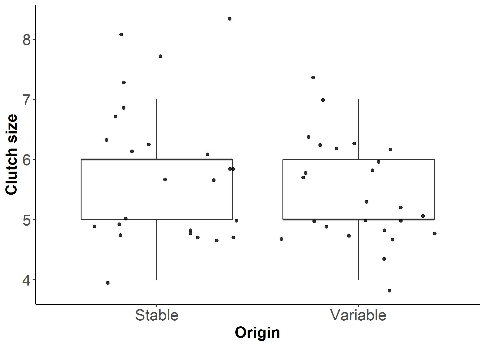
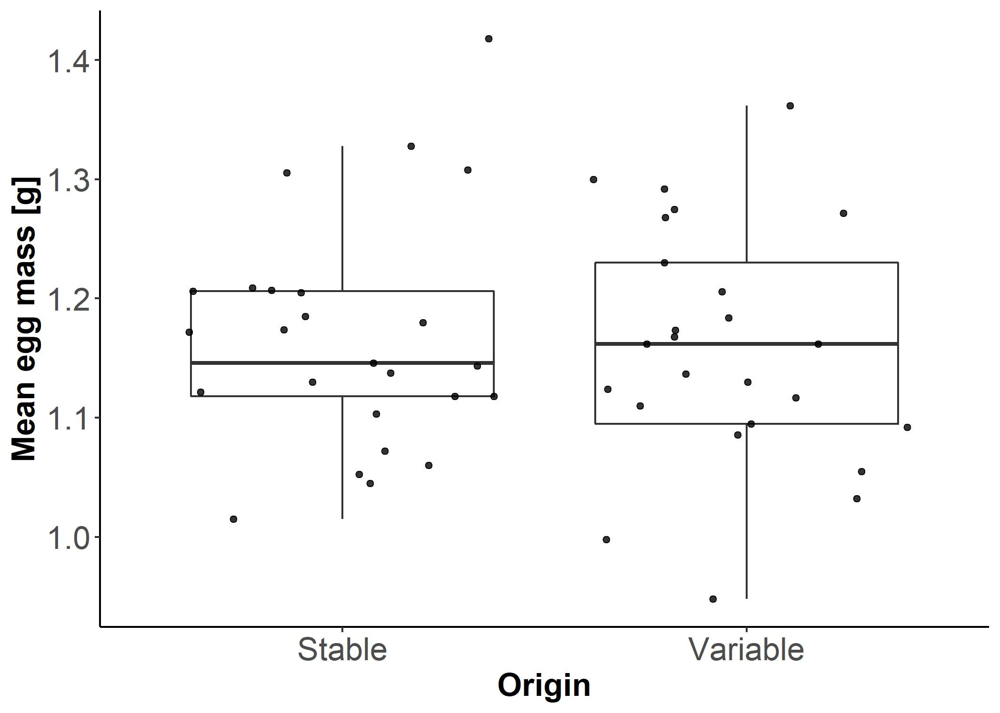
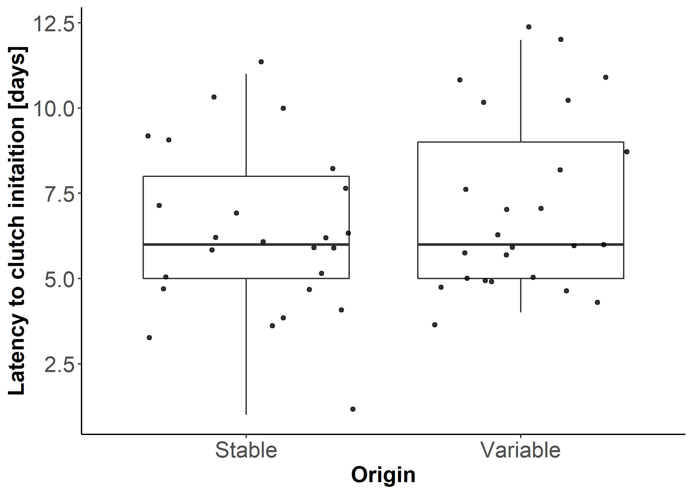

```{r setup, include=FALSE}
# tutors should use the setting in which all comments and code are visible
#knitr::opts_chunk$set(eval = TRUE, include = TRUE)

# instructions for the class should be generated without the code
knitr::opts_chunk$set(eval = TRUE, echo = FALSE, message = FALSE)

```

```{r packages, warning=FALSE}

library(readxl)
library(tidyverse)

```

# Instructions for the class – part 1
### Loading the data
#### 1.	Load the data from breeding sheet to RStudio and name it **breeding_ZF**. 

It will look like this:


```{r loading anad general inspection, warning=FALSE}
excel_sheets("2020-09-30-Learning-finches-database.xlsx")
breeding_ZF <- read_excel("2020-09-30-Learning-finches-database.xlsx", sheet = "breeding")
head(breeding_ZF)

```
Our first, general task is to summarize reproductive performance of the pairs which where breeding (i.e. laid at least one egg) in one of the two experimental conditions, STABE or VARIABLE. The exp. condition of a given pair is denoted by variable `Origin`. The pair identifier is `box`. 


#### 2.	Visually inspect the dataset.

How may records are there for each pair? Are there pairs without any eggs?


#### 3.	Reduce dataset to lines that have information about an egg. 

This can be done by filtering the original data frame to a dataset in which `eggno` variable is greater or equal to 1. As a result you will get data frame with 288 rows.

***

### Calculating summary information for each breeding pair

We would like to get table in which: each `box` has only one row, there is information on which experimental condition this box belongs to, and there are columns with i) clutch size, ii) mean egg mass and iii) latency to laying the first egg. Thus, the outcome should look like that:  


#### 4.	Create table as the one above 

This can be done in a few lines of a code using pipe. It can also be coded in few separate steps. The steps are suggested below: 


a) create data frame named e.g. **by_pair**  using group_by() function run over the main data frame in which the two identifying variables (`Origin` and `box`) will be indicated. The product of this function looks the same as the original data frame.


b) create data frame named e.g. **pair_data** using summarise() function, in which the input data is taken from **by_pair** and which calculates: i) clutch size as number of records and ii) mean egg mass as mean value of the `eggw` variable.

The variable still missing from this table is latency to clutch initiation. This variable can be calculated as difference between date of laying the first egg of a clutch and date of pairing the birds.

c) One of the ways of getting the desired column is to follow the steps a) and b), but this time on the subset of the main data frame limited to rows in which variable `eggno` equals 1. 
 
Such data frame does not have the information on clutch size and egg mass. But it has the column `box`, which identifies the breeding pair in the previously created data frame. 

d)	The two data frames can be joined using left_join() function. Suggestion: if you keep `Origin` as the second identifier, it would not be doubled in the data frame!


```{r making data frame with one value for each box}
# Method step by step
# making sure that each line has information about an egg, based on the column with egg number
breeding_ZF <- subset(breeding_ZF, eggno >="1")

#same can be achieved by filter
breeding_ZF <- filter(breeding_ZF, eggno >="1")

# arranging data by experimental group and box
by_pair <- group_by(breeding_ZF, Origin, box)

# creating new data frame in which information for each box is summarized (this could be done is separate steps)
pair_data <- summarise(by_pair, clutch_size = n(), mean_egg = mean(eggw))

# limiting the data set to rows with eggno = 1 and calculating the difference between startd and ldate  
breeding_ZF_1egg <- subset(breeding_ZF, eggno =="1")
by_pair_1egg <- group_by(breeding_ZF_1egg, Origin, box)
pair_data_1egg <- summarise(by_pair_1egg,latency = ldate - startd)

# joining the two data frames
by_pairs <- left_join (pair_data, pair_data_1egg, by = c("Origin", "box"))

head(by_pairs)


## Method using pipe
# the same as above in less steps, using pipe
by_pair_2 <- breeding_ZF %>% filter(eggno >=1) %>% group_by(Origin, box) %>% 
  summarise(clutch_size = n(),
            mean_egg_mass = mean(eggw))

## shorter code for column with latency using pipe 
pair_data_1egg_2 <- breeding_ZF %>% filter(eggno == 1) %>% group_by(Origin, box) %>% 
  summarise(latency = ldate - startd)

# joining using pipe
by_pair_2 <- by_pair_2 %>% left_join(pair_data_1egg_2, by = c("Origin", "box"))


# Method for summarizing all three variables: use mutate and minimum with summarise, then you don't have to use left_join

by_pair_3 <- breeding_ZF %>% filter(eggno >=1) %>% 
  mutate(d = ldate - startd) %>% group_by(Origin, box) %>% 
  summarise(clutch_size = n(),
            mean_egg_mass = mean(eggw),
            latency = min(d))

```
***

### Visualising breeding data grouped by the experimental condition
#### 5.	Make graphs visualizing values calculated in the previous step, accounting for experimental condition of each breeding pair. 

Suggested graphs: box-plots that also show individual data points. 

There are endless ways in which one can alter the appearance of a graph. Below you can see the examples in which the several elements of the graph were defined in the code, i.e.: label of the y axis, scale breaks of the x axis, size and boldness fonts, of the size of points and their transparency.

```{r figures with data grouped by the experiment }

fig_1 <- ggplot(data=by_pairs, mapping = aes(x= Origin, y = clutch_size))+
  geom_boxplot(outlier.shape = NA)+
  geom_jitter(color="black", size=1.4, alpha=0.8) +
  ylab("Clutch size")+
  scale_x_discrete(breaks=c("STABLE","VARIABLE"),
        labels=c("Stable", "Variable"))+
  theme_classic()+
  theme( axis.text=element_text(size=16),
         axis.title=element_text(size=16,face="bold"))+
  ggsave("Fig-Clutch_size.jpg")
fig_1

fig_2 <- ggplot(data=by_pairs, mapping = aes(x= Origin, y = mean_egg))+
  geom_boxplot(outlier.shape = NA)+
  geom_jitter(color="black", size=1.4, alpha=0.8) +
  ylab("Mean egg mass [g]")+
  scale_x_discrete(breaks=c("STABLE","VARIABLE"),
        labels=c("Stable", "Variable"))+
  theme_classic()+
   theme( axis.text=element_text(size=16),
         axis.title=element_text(size=16,face="bold"))+
ggsave("Fig-Mean_egg_mass.jpg")
fig_2

fig_3 <- ggplot(data=by_pairs, mapping = aes(x= Origin, y = latency))+
  geom_boxplot(outlier.shape = NA)+
  geom_jitter(color="black", size=1.4, alpha=0.8) +
  ylab("Latency to clutch initaition [days]")+
  scale_x_discrete(breaks=c("STABLE","VARIABLE"),
        labels=c("Stable", "Variable"))+
  theme_classic()+
  theme( axis.text=element_text(size=16),
         axis.title=element_text(size=16,face="bold"))+
ggsave("Fig_Latency.jpg")
fig_3
```



