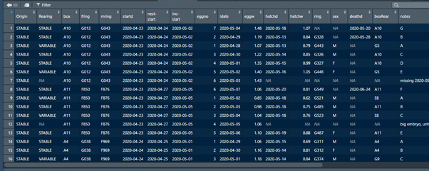
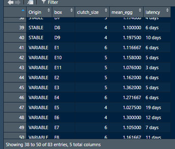

Transformations of behavioural datasets
================
Joanna Rutkowska
2021 05 18

# Instructions for the class – part 1

### Loading the data

#### 1. Load the data from breeding sheet to RStudio and name it **breeding\_ZF**.

It will look like this:

    ## [1] "breeding" "learning" "Metadata"

    ## # A tibble: 6 x 19
    ##   Origin Rearing  box   fring mring startd              `nest-start`       
    ##   <chr>  <chr>    <chr> <chr> <chr> <dttm>              <dttm>             
    ## 1 STABLE STABLE   A10   G012  G043  2020-04-23 00:00:00 2020-04-24 00:00:00
    ## 2 STABLE STABLE   A10   G012  G043  2020-04-23 00:00:00 2020-04-24 00:00:00
    ## 3 STABLE VARIABLE A10   G012  G043  2020-04-23 00:00:00 2020-04-24 00:00:00
    ## 4 STABLE STABLE   A10   G012  G043  2020-04-23 00:00:00 2020-04-24 00:00:00
    ## 5 STABLE STABLE   A10   G012  G043  2020-04-23 00:00:00 2020-04-24 00:00:00
    ## 6 STABLE VARIABLE A10   G012  G043  2020-04-23 00:00:00 2020-04-24 00:00:00
    ## # ... with 12 more variables: inc-start <dttm>, eggno <dbl>, ldate <dttm>,
    ## #   eggw <dbl>, hatchd <dttm>, hatchw <dbl>, ring <chr>, sex <chr>,
    ## #   deathd <dttm>, boxRear <chr>, notes <chr>, nests.notes <chr>

Our first, general task is to summarize reproductive performance of the
pairs which where breeding (i.e. laid at least one egg) in one of the
two experimental conditions, STABE or VARIABLE. The exp. condition of a
given pair is denoted by variable `Origin`. The pair identifier is
`box`.

#### 2. Visually inspect the dataset.

How may records are there for each pair? Are there pairs without any
eggs?

#### 3. Reduce dataset to lines that have information about an egg.

This can be done by filtering the original data frame to a dataset in
which `eggno` variable is greater or equal to 1. As a result you will
get data frame with 288 rows.

------------------------------------------------------------------------

### Calculating summary information for each breeding pair

We would like to get table in which: each `box` has only one row, there
is information on which experimental condition this box belongs to, and
there are columns with i) clutch size, ii) mean egg mass and iii)
latency to laying the first egg. Thus, the outcome should look like
that:  

#### 4. Create table as the one above

This can be done in a few lines of a code using pipe. It can also be
coded in few separate steps. The steps are suggested below:

1.  create data frame named e.g. **by\_pair** using group\_by() function
    run over the main data frame in which the two identifying variables
    (`Origin` and `box`) will be indicated. The product of this function
    looks the same as the original data frame.

2.  create data frame named e.g. **pair\_data** using summarise()
    function, in which the input data is taken from **by\_pair** and
    which calculates: i) clutch size as number of records and ii) mean
    egg mass as mean value of the `eggw` variable.

The variable still missing from this table is latency to clutch
initiation. This variable can be calculated as difference between date
of laying the first egg of a clutch and date of pairing the birds.

3.  One of the ways of getting the desired column is to follow the
    steps a) and b), but this time on the subset of the main data frame
    limited to rows in which variable `eggno` equals 1.

Such data frame does not have the information on clutch size and egg
mass. But it has the column `box`, which identifies the breeding pair in
the previously created data frame.

4.  The two data frames can be joined using left\_join() function.
    Suggestion: if you keep `Origin` as the second identifier, it would
    not be doubled in the data frame!

<!-- -->

    ## # A tibble: 6 x 5
    ## # Groups:   Origin [1]
    ##   Origin box   clutch_size mean_egg latency
    ##   <chr>  <chr>       <int>    <dbl> <drtn> 
    ## 1 STABLE A10             7     1.31 5 days 
    ## 2 STABLE A11             6     1.02 9 days 
    ## 3 STABLE A4              5     1.17 5 days 
    ## 4 STABLE A5              5     1.12 7 days 
    ## 5 STABLE A6              6     1.10 6 days 
    ## 6 STABLE A7              6     1.20 6 days

------------------------------------------------------------------------

### Visualising breeding data grouped by the experimental condition

#### 5. Make graphs visualizing values calculated in the previous step, accounting for experimental condition of each breeding pair.

Suggested graphs: box-plots that also show individual data points.

There are endless ways in which one can alter the appearance of a graph.
Below you can see the examples in which the several elements of the
graph were defined in the code, i.e.: label of the y axis, scale breaks
of the x axis, size and boldness fonts, of the size of points and their
transparency.

<!-- --><!-- --><!-- -->
