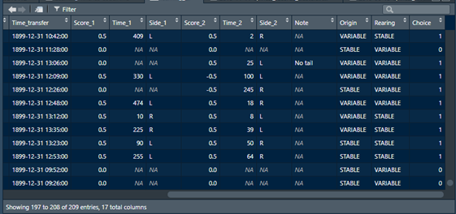
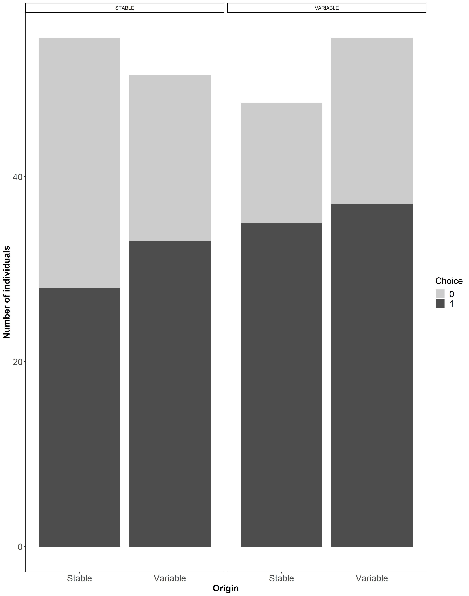
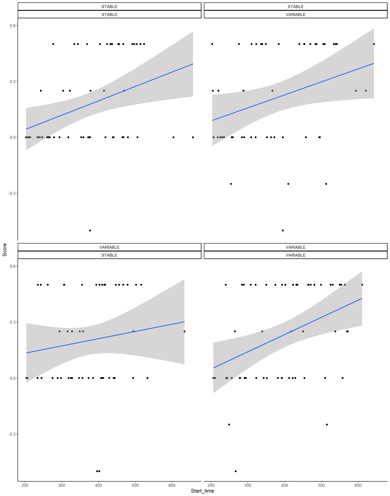

```{r setup, include=FALSE}
# tutors should use the setting in which all comments and code are visible
#knitr::opts_chunk$set(eval = TRUE, include = TRUE)

# instructions for the class should be generated without the code
knitr::opts_chunk$set(eval = TRUE, echo = FALSE, message = FALSE)

```

```{r packages}

library(readxl)
library(tidyverse)

```

# Instructions for the class – part 2
### Loading the data
#### 1. Load the data from learning sheet to RStudio and name it **learning_ZF**.
#### 2.	Visually inspect the data. 

You will notice that columns which in Excel had the hour:minute or minute:second format have additional, ridiculous date in front. We will deal with this problem later. 

```{r loading laearning dataset }
learning_ZF <- read_excel("2020-09-30-Learning-finches-database.xlsx", sheet = "learning")
head(learning_ZF)

```

***

### Adding information on the experimental treatment to the learning dataset

Learning dataset has one row of results of the behavioural observations, which were carried out blind with respect to the experimental group of a given individual. The information on experimental group can be retrieved from the breeding dataset. More specifically, each individual is characterized by two treatments: variable `Origin` denotes environmental conditions its parents experienced during breeding while variable `Rearing` denotes environmental conditions experienced since hatching. 

#### 3.	Load the breeding dataset again and inspect it. 

You will easily see `Origin` and `Rearing` variables, that you need to add to the **learning_ZF** data frame. But you also need individual identifier. In the breeding dataset, it is denoted by variable `ring`. 

a)	Add new column to the **breeding** data frame. It should be called `BirdID` and should have the same values as variable `ring`. Alternatively, rename() the column `ring` into `BirdID`.

b)	From the **breeding** data frame select a subset consisting only of three columns: `BirdID`, `Origin` and `Rearing`

c)	Join the above data frame to the **learning_ZF** data frame

d)	Depending on the method you've used, the resulting data frame might contain some empty cells, which should be removed based e.g. on whether `Test_date` in a given row is not empty.

As a result, you will get data frame with 209 rows and `Origin` and `Rearing` columns at the end.

```{r adding information on the experimental treatment to the learning dataset }
# loading breeding dataset
breeding_ZF <- read_excel("2020-09-30-Learning-finches-database.xlsx")
head(learning_ZF)

#Method without pipe

# adding new column with "BirdID to the breeding data frame 
breeding_ZF <- mutate(breeding_ZF, BirdID = ring)

# creating new data frame with BirdID and Origin and Rearing columns
breeding_ZF_subset <- select(breeding_ZF, BirdID,  Origin, Rearing)

# joining data frame with Origin and Rearing to the learning data frame
learning_ZF <- right_join(learning_ZF, breeding_ZF_subset, by="BirdID")

#the data frame has some empty cells, which should be removed based e.g. on whether there is a test date
learning_ZF <- filter(learning_ZF, !is.na(Test_date))


#Method with pipe
#  change the ring into BirdID in that dataframe and use pipe with select in one step
breeding_ZF_subset_1 <- breeding_ZF %>% mutate(BirdID = ring) %>% select(BirdID, Origin, Rearing)

# joining data frame with Origin and Rearing to the learning data frame using pipe
learning_ZF_1 <- learning_ZF %>% left_join(breeding_ZF_subset_1, by = "BirdID")


```

***

### Calculation and visualization of number of individuals participating in the learning test
Information on whether a given individual took part in the test can be retrieved from two variables indicating how long it took to make a choice. We will consider that a given individual made a choice if at least one of the variables `Time_1` and `Time_2` contains numerical value (is different than NA). 

#### 4. Create new variable called `Choice` that will have “0” if individual did not make any choices or “1” if it made at least one choice. 

```{r Calculation of number of individuals participating in the learning test }
# adding a column "Choice" indicating that choice took place (column is based on whether Time_1 or Time_2 column contains numerical value (is different than NA).  Solution using pipe:
learning_ZF <- learning_ZF %>% mutate(Choice = ifelse((is.na(Time_1) & is.na(Time_2)), 0, 1))
```

If performed correctly, the end-side of the data frame will look like that:


***

#### 5.	Visualize number of individuals that made a choice and those that did not, taking into account their `Origin` and `Rearing` experimental conditions. 

The graph can be made in several different ways, the one below is an example using geom_bar.  Suggestion: in the code for figure indicate that `Choice` is a factor, or character, or has logical value.
```{r  visulaisation of the above}

fig_4 <- ggplot(data = learning_ZF)  +
  geom_bar(aes(x= Origin, fill= factor(Choice)))+ 
    facet_wrap(vars(Rearing))+
    ylab("Number of individuals")+
  scale_x_discrete(breaks=c("STABLE","VARIABLE"),
        labels=c("Stable", "Variable"))+
  theme_classic()+
  theme( axis.text=element_text(size=16),
         axis.title=element_text(size=16,face="bold"))+
  labs(fill = "Choice", labels=c("No", "Yes"))+
  theme(legend.title = element_text(size = 16),
          legend.text = element_text(size = 16))+
  scale_fill_grey(start = 0.8, end = 0.3)+
  ggsave("Fig_Choice.jpg", scale = 3, width = 10, units=c("cm") )
fig_4
```


***

### Calculations on variables in time format
Individual performance in the learning test could be affected by its motivation that presumably increased with time of food deprivation. For each individual, the beginning of the test is denoted by variable `Time_transfer`, which has additional, unnecessary date in front. We would like to have new variable called `Start_time` which would be expressed in minutes passed since 7 am. 

#### 6.	Take the following steps:
a)	change the variable `Time_transfer` using strftime() function into format %H:%M:%S. As a result you will get character variable.

b)	change this variable using as.POSIXct() function again into format %H:%M:%S. This time a current date will be attached (ignore that).

c)	add new variable called `Lights_on`, in which all rows will be filled with 07:00:00.

d)	Change `Lights_on` into time format using as.PSIXct() function.

e)	Make a new column called `Start_time`, which will show the difference between `Lights_on` and `Time_transfer`. The value should be expressed in minutes or be numeric.

The above steps can be executed separately, or can be joined in one command using pipe. 

```{r Calculations on variables in time format}
# Calculating time of the test initiation, to be expressed in minutes after 7am based on data available in hours:min format. 

# change the variable Time_transfer using strftime function into format %H:%M:%S. As a result you will get character variable
learning_ZF$Time_transfer <- strftime(learning_ZF$Time_transfer, format = "%H:%M:%S")

# change the variable using as.PSIXct function again into format %H:%M:%S. This time a current date will be attached;  if you run this without the previous step the date would become 1899.
learning_ZF$Time_transfer <- as.POSIXct(learning_ZF$Time_transfer,format="%H:%M:%S")

# new column Lights on
learning_ZF <- mutate(learning_ZF, Lights_on = "07:00:00")

# Lights on as.posixct time format
learning_ZF$Lights_on <-as.POSIXct(learning_ZF$Lights_on,format="%H:%M:%S")

# get the difference between the 2 time columns
learning_ZF <- mutate(learning_ZF, Start_time= difftime(Time_transfer, Lights_on, units="mins"))

#this also works the same:
learning_ZF$start_time<- with(learning_ZF, difftime(learning_ZF$Time_transfer,learning_ZF$Lights_on, units="mins"))

# code for calculation Start_time using pipe
learning_ZF_1 <- learning_ZF_1 %>% 
  mutate(Time_transfer = strftime(Time_transfer, "%H:%M:%S")) %>%
  mutate(Time_transfer = as.POSIXct(Time_transfer, format = "%H:%M:%S")) %>% 
  mutate(Lights_on = as.POSIXct("07:00:00", format = "%H:%M:%S")) %>%
  mutate(Start_Time = as.numeric((Time_transfer - Lights_on), units = "mins")) 

```

***

### Visualization of data using scatterplot
#### 7.	Create new variable `Score`, which will be the mean of `Score_1` and `Score_2` variables. 

Suggestion: use function rowMeans() with na.rm=TRUE argument.
```{r creating column with mean Score}
# creating new column with the mean of scores in the first and second trial
learning_ZF$Score <- rowMeans(learning_ZF[,c("Score_1","Score_2")], na.rm=TRUE)

```

#### 8.	Make a scatter plot showing `Score` as a function of `Start_time`, separately for each combination of `Origin` and `Rearing` treatments. 

The graph can be made in several different ways, the one below is an example using geom_point and geom_smooth with “lm” method.

```{r Scatter plot showing outcome of the test over the time of test initiation}

# the above step could also be joined to the previous code calculating Start_time
learning_ZF_1 <- learning_ZF_1 %>% 
  mutate(Time_transfer = strftime(Time_transfer, "%H:%M:%S")) %>%
  mutate(Time_transfer = as.POSIXct(Time_transfer, format = "%H:%M:%S")) %>% 
  mutate(Lights_on = as.POSIXct("07:00:00", format = "%H:%M:%S")) %>%
  mutate(Start_Time = as.numeric((Time_transfer - Lights_on), units = "mins")) %>% 
  rowwise() %>% 
  mutate(Score = mean(Score_1, Score_2, na.rm = TRUE)) %>% 
  ungroup()


fig_5 <-ggplot(data = learning_ZF, aes(x = Start_time, y= Score))+
  facet_wrap(~~Origin + Rearing)+
  geom_point()+
  geom_smooth(method = "lm")+
theme_classic()+
ggsave("Fig_Score_Start.jpg", scale = 3, width = 10, units=c("cm") )
fig_5
```


### Optional homework for students
```{r Optional homework for students, include=FALSE}

# adding a column "Choice" indicating that choice took place (column is based on whether Score_1 or Score_2 column has value different than 0.0) 
learning_ZF$Choice_bis <- ifelse((learning_ZF$Score_1 | learning_ZF$Score_2) != 0.0, 1, 0)


# creating new column with the mean of latency to choice times
learning_ZF$Mean_latency <- rowMeans(learning_ZF[,c("Time_1","Time_2")], na.rm=TRUE)

# figure
fig_6 <-ggplot(data = learning_ZF, aes(x = Mean_latency, y= Score))+
  facet_wrap(~~Origin + Rearing)+
  geom_point()+
  geom_smooth(method = "lm")+
theme_classic()
fig_6
```


